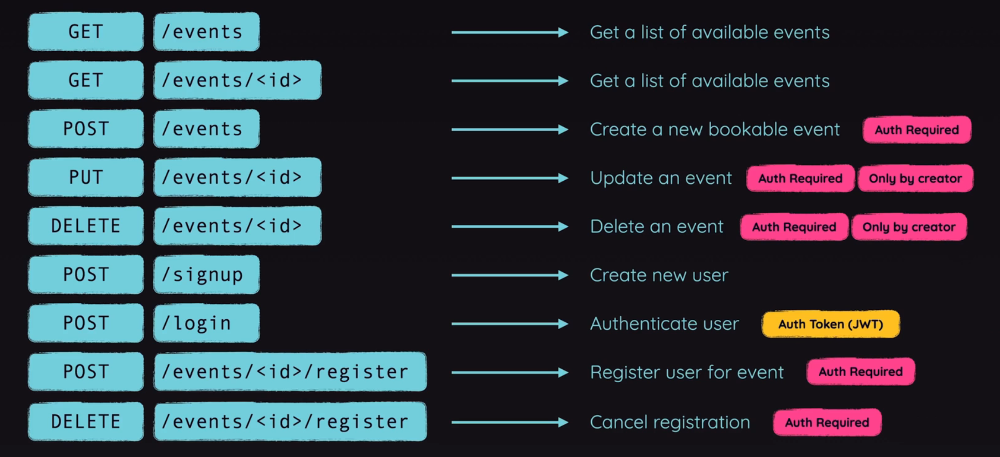

# Event Management REST API
* This is a simple REST API for event management. It is built using Golang. It allows users to create, update, delete and view events. 
* It also allows users to register for events and cancel the events they have registered for.
* User login and registration is also supported.

## The following requestes are supported:


## Prerequisite
Please [install and set-up Golang](https://go.dev/doc/install) on your system in advance.
## Installation
- Clone this Project and Navigate to the folder.

``` bash
git clone https://github.com/dvjsharma/Rest-in-Go.git
cd Rest-in-Go
```
- Install the dependencies
``` bash
go get ./...
```
- Run the server
``` bash
go run main.go
```
- The server will start at `http://localhost:3000`

NOTE: The server will not start if db throws an error, in general case installing ```build-essential``` will solve the issue.

## Documentation
- This project is documented using Swagger, which is a tool that helps you design, build, document, and consume RESTful web services.

- Run the project and navigate to `http://localhost:3000/docs/index.html` to view the documentation.

- Optionally, after changing any documentation comments, format them with following command.
    ```bash
    swag fmt
    ```
- This process will automatically update the documentation based on the comments in the code.